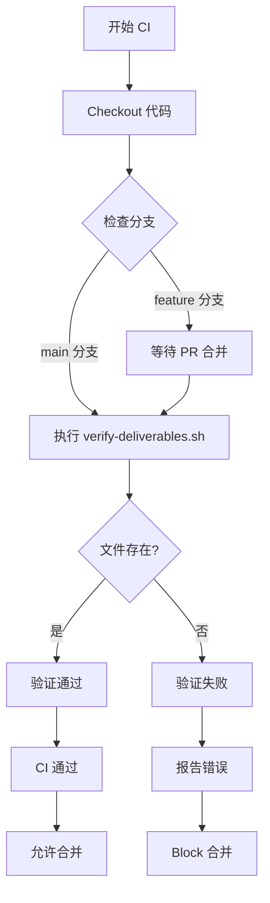

# CI 验证机制文档

## 概述

本文档描述 minimall 项目的 CI 验证机制，用于确保交付物的真实性和完整性。

---

## verify-deliverables.sh 使用说明

### 脚本信息

- **路径**: `scripts/verify-deliverables.sh`
- **用途**: 验证交付物文件是否存在
- **验证方式**: 使用 `test -f` 检查文件是否为普通文件

### 使用方法

```bash
./scripts/verify-deliverables.sh <文件1> [文件2] ...
```

### 参数说明

| 参数 | 说明 |
|------|------|
| `<文件1> [文件2] ...` | 要验证的文件路径，支持多个文件 |

### 退出码

| 退出码 | 含义 |
|--------|------|
| `0` | 全部文件存在 |
| `1` | 任意文件缺失 |

### 示例

```bash
# 验证单个文件
./scripts/verify-deliverables.sh config/application.yml

# 验证多个文件
./scripts/verify-deliverables.sh config/application.yml config/logging.properties

# 验证整个交付物集合
./scripts/verify-deliverables.sh \
  docs/fake-delivery-blacklist.md \
  src/test/java/com/minimall/controller/ProductControllerTest.java \
  src/test/java/com/minimall/controller/AuthControllerTest.java
```

### 输出示例

```
=== 交付物验证 ===

✅ config/application.yml
✅ config/logging.properties

=== 汇总 ===
总计: 2
通过: 2
失败: 0

✅ 全部验证通过
```

---

## CI 工作流程图

### Mermaid 流程图



### ASCII 流程图

```
┌─────────────────────────────────────────────────────────────┐
│                          CI 开始                            │
└─────────────────────────────────────────────────────────────┘
                                │
                                ▼
┌─────────────────────────────────────────────────────────────┐
│                      Checkout 代码                           │
└─────────────────────────────────────────────────────────────┘
                                │
                                ▼
                    ┌───────────────────┐
                    │   检查分支类型     │
                    └───────────────────┘
                                │
              ┌─────────────────┴─────────────────┐
              │                                   │
              ▼                                   ▼
    ┌─────────────────┐                 ┌─────────────────┐
    │   main 分支      │                 │  feature 分支   │
    │  直接验证        │                 │  等待 PR 合并    │
    └─────────────────┘                 └─────────────────┘
              │                                   │
              └─────────────────┬─────────────────┘
                                │
                                ▼
              ┌───────────────────────────────────┐
              │  执行 verify-deliverables.sh      │
              │  使用 test -f 验证每个文件        │
              └───────────────────────────────────┘
                                │
                                ▼
                    ┌───────────────────┐
                    │   文件都存在?      │
                    └───────────────────┘
                      │               │
                      │ 是            │ 否
                      ▼               ▼
            ┌─────────────┐   ┌─────────────┐
            │  CI 通过     │   │  CI 失败    │
            │  允许合并   │   │ Block 合并  │
            └─────────────┘   └─────────────┘
```

### 详细步骤说明

| 步骤 | 操作 | 说明 |
|------|------|------|
| 1 | Checkout 代码 | 获取源代码 |
| 2 | 检查分支 | 判断是 main 还是 feature 分支 |
| 3 | 执行验证 | 对 main 分支直接执行 verify-deliverables.sh |
| 4 | 验证结果 | 检查每个文件是否存在 |
| 5 | 报告状态 | 通过则允许合并，失败则阻止 |

---

## 常见问题与解决方案

### Q1: 脚本执行权限不足

**问题**: `Permission denied` 错误

**原因**: 脚本没有执行权限

**解决方案**:
```bash
chmod +x scripts/verify-deliverables.sh
```

### Q2: 文件存在但验证失败

**问题**: 文件存在但 `test -f` 返回 false

**可能原因**:
- 文件是目录而不是普通文件
- 文件是符号链接但指向不存在的目标
- 文件系统权限问题

**解决方案**:
```bash
# 检查文件类型
ls -la path/to/file

# 确认是普通文件而非目录
test -f path/to/file && echo "是普通文件" || echo "不是普通文件"
```

### Q3: CI 在 feature 分支失败

**问题**: feature 分支上验证失败

**原因**: 验证只在 main 分支执行，feature 分支需要 PR 合并后才能通过

**解决方案**:
- 确保交付物已添加到 Git 并 commit
- 创建 PR 合并到 main 分支
- 验证将在 CI 中自动执行

### Q4: 相对路径验证失败

**问题**: 使用相对路径时验证失败

**原因**: 工作目录不是预期位置

**解决方案**:
```bash
# 使用绝对路径
./scripts/verify-deliverables.sh /full/path/to/file

# 或在正确目录执行
cd /project/root && ./scripts/verify-deliverables.sh relative/path
```

### Q5: 文件被 .gitignore 忽略

**问题**: 文件存在但无法添加到 Git

**原因**: 文件被 .gitignore 排除

**解决方案**:
```bash
# 检查文件是否被忽略
git check-ignore -v path/to/file

# 如果需要强制添加
git add -f path/to/file
```

---

## 文件验证规范

### test -f vs test -d

| 命令 | 含义 | 适用场景 |
|------|------|----------|
| `test -f <file>` | 检查是否为普通文件 | **必须使用** - 验证文件交付物 |
| `test -d <file>` | 检查是否为目录 | 仅用于目录类型交付物 |

### 为什么使用 test -f

1. **精确性**: `test -f` 只匹配普通文件，不匹配目录
2. **安全性**: 防止将目录误认为文件交付物
3. **一致性**: 与 Git 对文件的定义一致

### 错误示例

```bash
# 错误：目录会被误认为通过
test -d docs && echo "通过"  # docs 是目录但会通过

# 错误：符号链接可能误导
test -d symlink-to-dir  # 符号链接指向目录会通过
```

### 正确示例

```bash
# 正确：只接受普通文件
test -f config/application.yml && echo "文件存在"

# 正确：验证多个文件
test -f file1.txt && test -f file2.txt && echo "所有文件存在"
```

### 验证检查表

| 检查项 | 命令 | 预期结果 |
|--------|------|----------|
| 文件存在且是普通文件 | `test -f <file>` | 退出码 0 |
| 文件非空 | `test -s <file>` | 退出码 0 |
| 文件可读 | `test -r <file>` | 退出码 0 |
| 文件在 Git 中 | `git ls-files <file>` | 输出文件路径 |

---

## CI 集成

### GitHub Actions 示例

```yaml
name: Verify Deliverables

on:
  pull_request:
    branches: [main]

jobs:
  verify:
    runs-on: ubuntu-latest
    steps:
      - uses: actions/checkout@v4
        with:
          ref: ${{ github.event.pull_request.head.ref }}

      - name: Verify Deliverables
        run: |
          ./scripts/verify-deliverables.sh \
            docs/fake-delivery-blacklist.md \
            src/test/java/com/minimall/controller/ProductControllerTest.java \
            src/test/java/com/minimall/controller/AuthControllerTest.java \
            src/test/java/com/minimall/controller/HealthControllerTest.java
```

### 本地验证

```bash
# 验证 main 分支上的交付物
git checkout main
./scripts/verify-deliverables.sh \
  docs/fake-delivery-blacklist.md \
  src/test/java/com/minimall/controller/ProductControllerTest.java
```

---

## 版本历史

| 版本 | 日期 | 修改内容 |
|------|------|----------|
| 1.0 | 2026-05-18 | 初始版本 - 包含使用说明、工作流程、FAQ 和验证规范 |